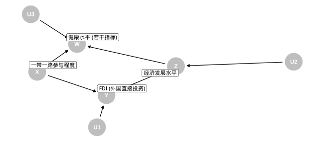

class: center, middle

# 出发！

```{r setup, include=FALSE}
library(knitr)
library(tidyverse)
library(xaringanthemer)
style_mono_accent(
  base_color = "#1c5253",
  header_font_google = google_font("Josefin Sans"),
  text_font_google   = google_font("Montserrat", "300", "300i"),
  code_font_google   = google_font("Fira Mono")
)
```

---
class: center, middle
# 引言

???

“一带一路”是我国的重要战略之一. 《中华人民共和国国民经济和社会发展第十三个五年规划纲要》提到要“推进‘一带一路’建设”，《中华人民共和国国民经济和社会发展第十四个五年规划和2035年远景目标纲要》同样提到要“推动共建‘一带一路’高质量发展”.

投资回报率是经济学上的一个重要概念. 越是发展中国家，由于其具有的潜在经济增长率越高，回报率自然越大. 但由于发展中国家难免有基础设施欠缺、政治不稳定、医疗健康水平低下等情况，又会使投资的失败率大大增加. 因此现实中，纵然发展中国家潜在投资回报率高，实际投资却并不充分. 一定程度上，“一带一路”计划基于政治互信，通过国家层间的协定，对投资中的不稳定因素起到了有效的限制作用. 但由于涉及国家广泛，文化背景复杂，每个国家的实际情况不同，我们仍然需要通过数据评价中国与每个沿线国家的相互投资水平.

我们发现，一带一路提出后，中国与一些沿线国家的投资水平有了显著增加，这或许是由于不稳定因素的减少. 而对多数国家，中国对其投资水平并未如愿得到额外增长. 这可能由原本投资水平较高、该国家稳定性一直较好等因素解释. 同时，这也启发我们：一带一路作为国家长期规划的重要部分，其效应不会在短时间内体现，而需要进行更长远地观察与研究. 

同时，我们将一带一路沿线国家与中国的相互投资水平进行了可视化，可以直观反映出一带一路的成效，并对不同国家进行定性比较. 此部分有很强的政策参考价值. 
我们还将研究更深入地推进了一步. 开始提到，落后的医疗健康状况也是不稳定因素之一，我们利用健康数据集，研究了一带一路对沿线国家健康水平的影响. 多种数据的运行结果均表明，一带一路有效促进了沿线国家健康水平的提升. 显然，健康水平的进步，可以通过提高本国投资稳定性，提高投资吸引力. 对于一带一路沿线健康水平较差的发展国家，有望形成良性循环，投资与健康水平相互促进，最终正向作用于经济发展. 

---
class: center, middle

# 主要工作

???

数据模型、分析技术、程序技术

---

## 数据模型

```{r echo=FALSE, out.width="120%", out.height="120%"}

```

Assumption: 不存在 $X\rightarrow Z$的线，即 $X\mathrel{\unicode{x2AEB}}Z|Y$.

???

此图在R语言中，用**ggdag**[@citation_ggdag]生成. 这是有向无环图(Directed acyclic graph, DAG)，其中边代表因果作用[@pearl].

值得注意的是，在该模型中，我们假定一带一路不会以其他方式影响地区的经济发展水平（即不存在$X\rightarrow Z$的线），以避免出现替代指标悖论.

---

## 分析技术

- 缺失数据填补

- 双重差分法

- 合成控制法

???

本项目主要利用到以下三种分析技术. 首先注意到数据集中存在许多缺失数据，如[图2](#missd)所示. 缺失数据的删除或填补需要用到一些技术. 分析一带一路的影响，就是要分析某一事件发生后，某一值的变化情况. 该值自身也存在着模型外因素导致的变化趋势，所以我们必须利用某些技术来去除这些因素的影响. 于是，我们运用如
下所述的双重差分和合成控制两种技术.

---

### 缺失数据填补


<!-- {#missd .class width=75% height=75%} -->

- 删除

- 填补：linear regression with bootstrap

???

我们的数据集，正和许多类似的真实世界数据集一样，存在着许多缺失数据`NA`. 缺失数据的处理方式不外乎删除或填补.

- 对于我们的investment数据集，其缺失普遍存在，故我们采用填补的方法.
- 对于本次大赛提供的世界健康数据集，其缺失更有规律，即对于任意一个国家，缺失一个时间点的数据意味着缺失此前所有数据. 恰当地选择时间范围，再删去个别几个缺失较大的国家[^cty]，就在可以避免填补的同时保留大部分数据. 因此，我们选择删去.

[^cty]: 这些国家往往那时才成立，例如从母国中分裂出.

对于前者，我们调用R包**mice**[@citation_mice]，采用linear regression with bootstrap的方法进行缺失数据填补. 首先，对数据进行bootstrap重抽样[@citation_bs]，然后进行线性回归插值，最终计算得到合成的结果. 其中，多元线性回归采用Schafer的算法[@schafer_1997].

---

### 二重差分法

二重差分法 (Difference-in-Differences, DID) 是一种经典技术. 具体来说，就是以下模型

$$P_{t}^{N}=\mu+\frac{1}{J} \sum_{j=2}^{J+1} Y_{j t}^{N}$$

并用如下公式来估计.

$$\hat{P}_{t}^{N}=\frac{1}{T} \sum_{s=1}^{T}\left(Y_{1 s}^{N}-\frac{1}{J} \sum_{j=2}^{J+1} Y_{j s}^{N}\right)+\frac{1}{J} \sum_{j=2}^{J+1} Y_{j t}^{N}$$

???

二重差分法(Difference-in-Differences, DID)是一种经典技术. 所谓二重差分，就是先把实验组与对照组作差，再对差作差分，考察其随时间的变化情况. 换句话说，此方法假定对于每个固定的 $t$，存在一个固定的内禀的 $\mu$. 具体来说，就是以下模型[@NBERw22791]

$$P_{t}^{N}=\mu+\frac{1}{J} \sum_{j=2}^{J+1} Y_{j t}^{N}$$

并用如下公式来估计.

$$\hat{P}_{t}^{N}=\frac{1}{T} \sum_{s=1}^{T}\left(Y_{1 s}^{N}-\frac{1}{J} \sum_{j=2}^{J+1} Y_{j s}^{N}\right)+\frac{1}{J} \sum_{j=2}^{J+1} Y_{j t}^{N}$$

---

### 合成控制法

合成控制法 (Synthetic Control) 是另一种经典技术. 具体来说，就是以下模型.

$$P_{t}^{N}=\sum_{j=2}^{J+1} w_{j} Y_{j t}^{N}, \text{where }w \geq 0,\  \sum_{j=2}^{J+1} w_{j}=1.$$

Assumption: $E\left(u_{i} Y_{j t}^{N}\right)=0 \text{, for } 2 \leq j \leq J+1 .$

于是就有估计 $\hat{P}_{t}^{N}=\sum_{j=2}^{J+1} \hat{w}_{j} Y_{j t}^{N}.$

而 $w$的估计 $\hat{w}=\underset{w}{\operatorname{argmin}} \sum_{i=1}^{T}\left(Y_{1 t}^{N}-\sum_{j=2}^{J+1} w_{j} Y_{j t}^{N}\right)^{2}, \text{ subject to }w\geq 0,\ \sum_{j=2}^{J+1} w_{j}=1.$

--

- $P$值，置信区间的计算 (Chernozhukov et al., 2021)

???

 不难发现，DID所要求的条件过高，在现实生活中一般并不成立. 举例来说，实验组可能有其自身特点，导致增长本来就比对照组快. 而所谓合成控制，就是用对照组的数据“合成”出来一个虚拟的实验组，然后应用到事件发生后的情况，得到实验组的反事实数据. 
 
 为了识别合成的权重 $w$，我们需要一些假设，在这里是结构冲击项 $u_{t}$在同一时段内互不相关，即
 
此后，我们利用Chernozhukov et al.[@doi:10.1080/01621459.2021.1920957]的方法分析P值和置信区间等信息.

---

## 程序技术

### Non-standard evaluation, NSE

```r
### Use lazy evaluation to replicate a func
repli <- function(fun) {
  ex <- substitute(fun)

  for (i in seq_along(country_list)) {
    # ...
    eval(ex, envir = globalenv())
  }
}

repli(placebo_specification_test())
```

--

- 只有在真正用到`fun`的时候才会对其进行求值，其中`fun`的返回值并不必须良定

???

本项目使用了一种在R中非常重要的技术，即Non-standard evaluation.[@wickham_2019]

具体来说，让我们看一段代码：

R采用lazy evaluation，只有在真正用到`fun`的时候才会对其进行求值，其中`fun`的返回值并不必须良定. 这在这里是重要的特性，因为一般的语言具有引用透明(reference transparency)的特点，会将`fun`的返回值作为`repli`的输入，这会对我们的目标造成不便. 此处，`substitute`将参数转变为`promise`，而并不对其进行求值；在`for`循环内部，调用`eval`进行求值，以达到重复执行某个函数的目的.

---

# 具体细节

- The Workflow

- 数据集说明

- 数据清洗

- 数据分析

- 数据可视化

---

class: center, middle

## The Workflow

```{r echo=FALSE, out.width="120%", out.height="120%"}
include_graphics("resources/workflow.png")
```

.footnote[此图取自 _R for Data Science_，以[CC BY-NC-ND 3.0 US](http://creativecommons.org/licenses/by-nc-nd/3.0/us/)发布.]

???

根据 _R for Data Science_，数据分析的一般流程如[图3](#wf)所示. 本项目也符合这种模式.

---

## 数据集说明

国际贸易数据（`/data/investment/FDI_untidy.csv`）下载自CEIC数据库. 我们引用CEIC全球数据库中“实际利用的外国资本：按地区分类”和“对外直接投资：国别”两个数据集，逐条下载了中国在利用其他国家资本量（月度数据），和中国对其他国家的直接投资（月度数据）. CEIC数据库覆盖的时间范围为1985年12月至2021年4月，每条数据均以月为统计单位. 

其他用到的数据集来自世界健康数据集，包括：

- under5MortalityRate.csv
数据集记录了1962-2019年不同国家5岁以下儿童死亡率（每千人的死亡人数）.

- infantMortalityRate.csv
数据集记录了1962-2019年不同国家出生婴儿死亡率（每千人的死亡人数）. 

???

故为了数据的完整性，初步清洗时，以纵轴为月份（自1985年12月至2021年4月），横轴为统计指标（中国利用不同国家的资本，与对不同国家的直接投资），对数据进行了合成与排列. 

其中，实际利用的外国资本分为直接投资和其他投资方式. 直接投资包括中外合资，合资开发和独资企业，外资参股公司以及共同开发；其他投资方式包括补偿贸易和加工组装. 数据来源为国家统计局和中华人民共和国商务部. 该数据可反映外国对中国的投资. 

对外直接投资指中国国内投资者以现金、实物、无形资产等方式在国外及港澳台地区设立、购买国（境）外企业，并以控制该企业的经营管理权为核心的经济活动. 数据统计来源为中华人民共和国商务部. 该数据可反映中国对外投资. 
我们认为，该指标反应了一国最基础的医疗水平状况. 相比预期寿命，该指标更好地将研究标的限制在了基础卫生条件，如洁净水源、疫苗接种、家庭卫生条件等. 而对于发展中国家，基础医疗状况和卫生水平的提高，才能最贴切地带来经济发展的动力. 故在预期寿命之外，我们还专门将“5岁以下儿童死亡率”作为研究指标. 

我们认为，相比5岁以下儿童死亡率，该指标更准确地反映了一国在生育保障上的医疗和健康水平. 

---

## 数据清洗

- 什么数据结构才算是整理好？

--

- 每行应该代表一个观察(observation)，每列应该代表一个变量(variable). 

--

- 利用**tidyverse**，进行数据清洗. 其部分步骤如下页所示.


???

虽然不为人所重视，数据清洗往往是数据分析工作中耗时最久的部分. 不仅如此，数据清洗的目标也往往不被人熟知. 什么数据结构才算是整理好？幸运的是，Hadley Wickham的文章向我们提供了一种通俗易懂的解释：每行应该代表一个观察(observation)，每列应该代表一个变量(variable). 根据此种原则，并利用其为此目的开发的R包**tidyverse**，进行数据清洗. 其部分步骤如下所示.

---

## 数据清洗

```r
simplified_df <- raw_df %>%
  filter(X1 %>% str_detect("^\\d"))
```
```r
fliped_df <- simplified_df %>%
  pivot_longer(c(-时间), names_to = "observation", values_to = "val")
```
```r
str %>%
  str_replace(pattern = "(.*):(总计|一带一路)", replacement = "1/\\2/\\2") %>%
  str_replace(pattern = "::", replacement = ":") %>%
  str_replace(pattern = "(.*):(.*洲):*(.*)", replacement = "1/\\2/\\3")
```
```r
df <- fliped_df %>%
  mutate(observation = observation %>% stdize()) %>%
  separate(col = "observation", into = c("type", "地区", "国家"), sep = "/") %>% 
  spread(key = "type", value = "val")
```

---

## 数据分析

数据建模和分析是传统上受重视的技术. 其主要内容[已经](#ana)详述，这里不再赘述.

???

对各个国家分别进行的分析结果存储于本项目`results`文件夹下的`results_IMR`（婴儿死亡率数据）和`results_invest`（投资数据）文件夹中. 其中，`sens.csv`描述了对测试进行安慰剂检验(placebo test)的情况，`p.noeff.csv`描述了测试的P值，`ci.csv`描述了结果的置信区间，`pdf`文件绘制出了按国家分类的置信区间的情况.

---

## 数据可视化

本节说明项目中所用到的可视化相关工具、组件、流程. 

### 可视化工具

项目将世界经济及其相关的数据，展示在世界地图上，考虑Python语言相对于JavaScript具有更好的数据处理能力，我们使用基于Apache Echarts[@LI2018136]的Pyecharts. 

我们主要做了如下几个可视化工作：

- 将2003到2019年的中国对外直接投资总额表示在地图上

- 将世界健康数据集中预期寿命和5岁以下死亡率分性别表示在图中

我们从图中可以定性地看出中国外企对于一带一路沿线国家的投入，以及相应国家的经济水平、生活水平的优化. 

---

### 文件结构

可视化相关的脚本以及输出结果全部储存在`./visualization`中. 

```
visualization
├── README.md
├── data
│   ├── FDI_filled_m.csv
│   ├── FDI_useful.csv
│   ├── LE.csv
│   ├── UFMR_m.csv
│   ├── country_ce.json
│   ├── syno_dict.json
│   └── world_country.json
├── mytool.ipynb
├── raw_plot
│   └── ...
├── out
│   ├── 五岁以下死亡率.html
│   ├── 外商直接投资情况-filled.html
│   ├── 外商直接投资情况.html
│   └── 预期寿命.html
├── FDI.py
└── world_health.ipynb
```

---

其中`./visualization/data/`是可视化所用到的数据，不仅包括我们绘图所需的数据，包括对外直接投资`FDI*.csv`、健康相关数据`LE*.csv`和`UFMR*.csv`等，还包括中英对照表`country_ce.json`、以及国家名的同义对照表`syno_dict.json`等工具数据. 

`raw_plot/`目录是用R生成的原始数据变化情况，其中一带一路参与国家以加粗线绘制.

`mytool.ipynb`为工具和测试用notebook，用于生成工具json和进行原型开发测试. 

`FDI.py`为对外直接投资可视化脚本，出于易用性，其中`render()`函数中给出的文件名，在得到成品文件后稍后手动更改为中文. 

`world_health.ipynb`为世界卫生健康相关数据可视化脚本，前两个cell分别用于绘制世界国家预期寿命和5岁以下死亡率，第三个cell尝试将不同的性别绘制在同一张图中，但是由于timeline和gender两个尺度只能分开调整，所以在时间纵向对比时并不方便，我们将结果绘制为三个图构成的Page Echarts图. 

`./visualization/out/`是可视化的文件，成品文件名已经更改，相对清楚. 注意其中`外商直接投资情况-filled.html`为利用算法填充部分缺失数据之后的FDI图像. 

---

### 流程

以FDI（对外直接投资）为例，我们讲述项目中使用的pyecharts可视化方法，相对其他几个可视化工作，其中使用了对数化、相对复杂，故说明后其余同理. 

```python
import pandas as pd                                   # 数据分析组件
import json                                           # 用于导入工具json
from pyecharts import options as opts                 # 用于调整pyecharts图的属性
from pyecharts.charts import Timeline, Map            # 选取pyecharts基本类型
from pyecharts.globals import ThemeType               # 选取pyecharts主题
import numpy as np                                    # python数值计算工具
tl = Timeline(init_opts=opts.InitOpts(
    theme=ThemeType.INFOGRAPHIC,
    bg_color='white',
    page_title='外商直接投资情况'
))                                                    # 生成timeline图结构
with open("./data/country_ce.json", 'r', encoding='utf-8') as f:
    ce_dict = json.load(f)                            # 导入国家名称中英文对照表

df = pd.read_csv('./FDI_filled_m.csv')                # 生成dataframe
df.iloc[:, 3] = df.iloc[:, 3].apply(np.log1p)         # 将数值列对数化
```

---

### 流程

```python
for year in range(2003, 2019+1):                      # 循环添加不同年份的数据到timeline图中
    map = (
        Map()                                         # 生成一个年份的地图
        .add(df.columns.tolist()[-1]+"（对数值，原单位：百万美元）",# 设定图层名
             [[ce_dict[row['国家']], row[3]]          # 读入数据，使用dataframe方法进行筛选
                 for _, row in df[df.iloc[:, 0] == year].iterrows()],
             maptype="world",                         # 设定为世界地图
             is_map_symbol_show=False,                # 不描点
             )
        .set_series_opts(label_opts=opts.LabelOpts(is_show=False)) # 在地图中不显示对应国家的数值
        .set_global_opts(
            title_opts=opts.TitleOpts(title=f"{year}年外商直接投资情况"), #设定当前页的标题
            visualmap_opts=opts.VisualMapOpts(
                max_=df[df.iloc[:, 0] == year].iloc[:, 3].max()),    # 重设图例范围
            toolbox_opts=opts.ToolboxOpts(),                         # 打开工具箱组件，便于后续使用鼠标调节

        )
    )
    tl.add(map, f"{year}年") # 将当前图层加入timeline结构中
tl.render("./out/vis.html") # 生成临时文件
```

---
class: center, middle
# 总结

---
## 分析结果

```{r include=FALSE}
ci_csv <- read_csv("../results/results_IMR/ci.csv")
cii_csv <- read_csv("../results/results_invest/ci.csv")
```

```{r}
ci_csv %>% filter(`max(ci.sc)`<0) %>% group_by(国家) %>% nest() %>% .[["国家"]]
ci_csv %>% filter(`min(ci.sc)`>0) %>% group_by(国家) %>% nest() %>% .[["国家"]]
ci_csv %>% .[["median(ci.sc)"]] %>% mean()
```

- 婴儿死亡率对数 $-0.04$！

???

可见，在一带一路的参与国家中，婴儿死亡率相比预期降低（$P<0.10$）的国家共有4个. 婴儿死亡率相比预期升高（$P<0.10$）的国家共有3个. 平均而言，一带一路能够额外降低婴儿死亡率的对数约0.04.

---

## 分析结果

```{r}
cii_csv %>% filter(`max(ci.sc)`<0) %>% group_by(国家) %>% nest() %>% .[["国家"]]
cii_csv %>% filter(`min(ci.sc)`>0) %>% group_by(国家) %>% nest() %>% .[["国家"]]
cii_csv %>% .[["median(ci.sc)"]] %>% mean()
```

- 投资额对数 $-0.40$！
--
- 在相同的经济发展水平下，参与一带一路能够相比预期增加沿线国家的国民健康水平，或者狭义来说，**降低婴儿死亡率**.

???

与预期不符的是，在一带一路的参与国家中，中国对当地的投资相比预期降低（$P<0.10$）的国家共有8个. 中国对当地的投资相比预期升高（$P<0.10$）的国家共有1个. 平均而言，参与一带一路反而额外降低中国对当地的投资的对数约0.40.

根据常识，投资($Y$)对经济发展水平($Z$)的平均因果作用是正的，而经济发展水平($Z$)对健康水平($W$)的平均因果作用也是正的. 因此，根据我们的模型，在相同的经济发展水平下，参与一带一路能够相比预期增加沿线国家的国民健康水平，或者狭义来说，降低婴儿死亡率. 从这一方面来看，一带一路对沿线国家经济以外的影响，还有待更深的评估.

---
class: center, middle

## 分析结果：

### 一带一路有效促进了沿线国家健康水平的提升.

---
class: center, middle
## 不足和展望

???

我们的报告最显著的不足之处是将不同国家的结论组合的方式显得过于随意，仅仅是计算每个国家的效应然后求平均，没有考虑到国家和国家的权重问题. 类似地，在计算投资额时，可以考虑除去国家的经济总量，以反映中国投资占比占该国家GDP的比例. 进一步地，一组国家总效应的置信区间并不必然是分别的效应的置信区间的函数. 然而，进一步研究这个问题需要更多的数学细节，并超过了本项目的范围.

---
class: center, middle

# THANKS

.footnote[[R Markdown](https://rmarkdown.rstudio.com) syntax,<br />Powered by [**xaringan**](https://github.com/yihui/xaringan) and [remark.js](https://remarkjs.com)]
